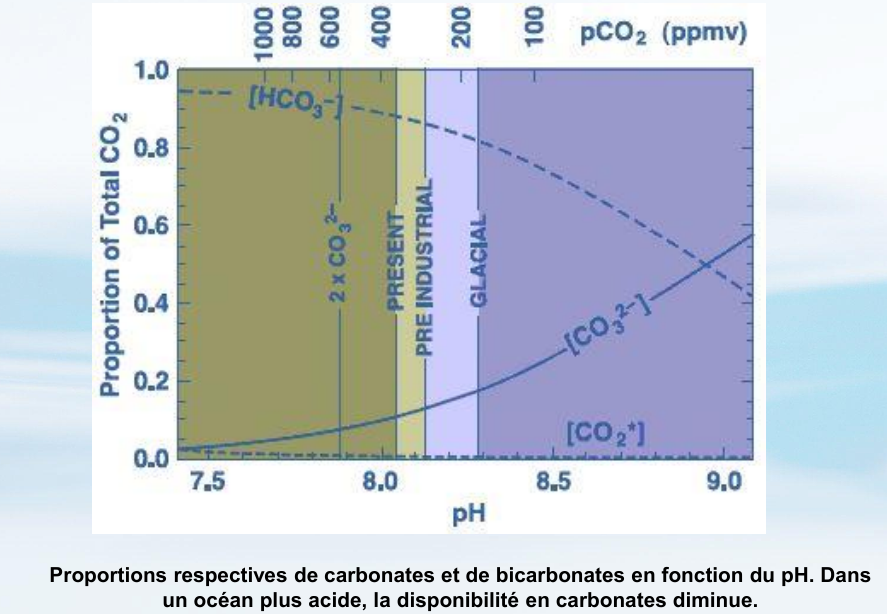
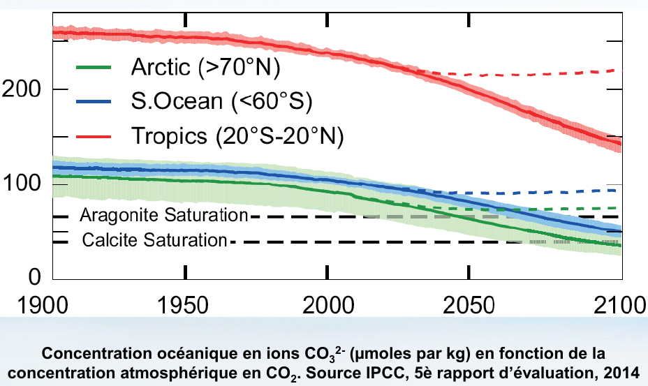

# CO2 dissolution

Causes
- [[co2-emissions]] change the carbon dioyxide [[partial-pressure-equilibrium]] between the [[atmosphere]] and the [[ocean]]
  - oceanic CO32- concentration change with atmospheric CO2 concentration

[//begin]: # "Autogenerated link references for markdown compatibility"
[co2-emissions]: co2-emissions.md "CO2 emissions"
[//end]: # "Autogenerated link references"