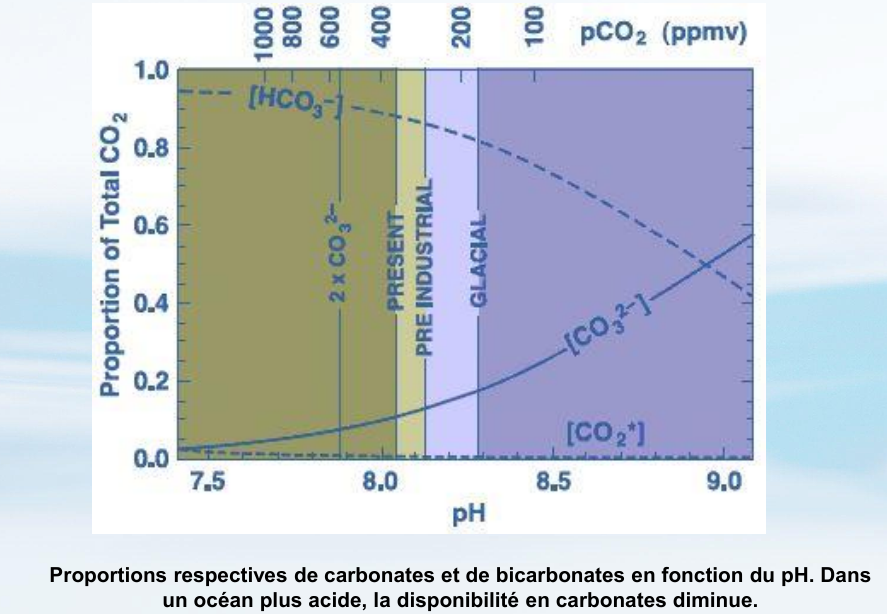

%%---
tags:
- 📋/🗺️ 
- ⌛
---%%

# ocean acidification

- [[CO2 emissions]] lead to [[CO2 dissolution]] from the [[atmosphere]] into the [[ocean]]
	- oceanic CO32- concentration change with atmospheric CO2 concentration
		- because of [[partial pressure equilibrium]]
		- 
- [[CO2 dissolution]] changes the [[oceanic pH]]
	- [[oceanic pH]] is essential to the formation of [[calcium carbonate]]
		- [[marine life]] use [[calcium carbonate]] to form shells and skeletons
		- 
	- 
